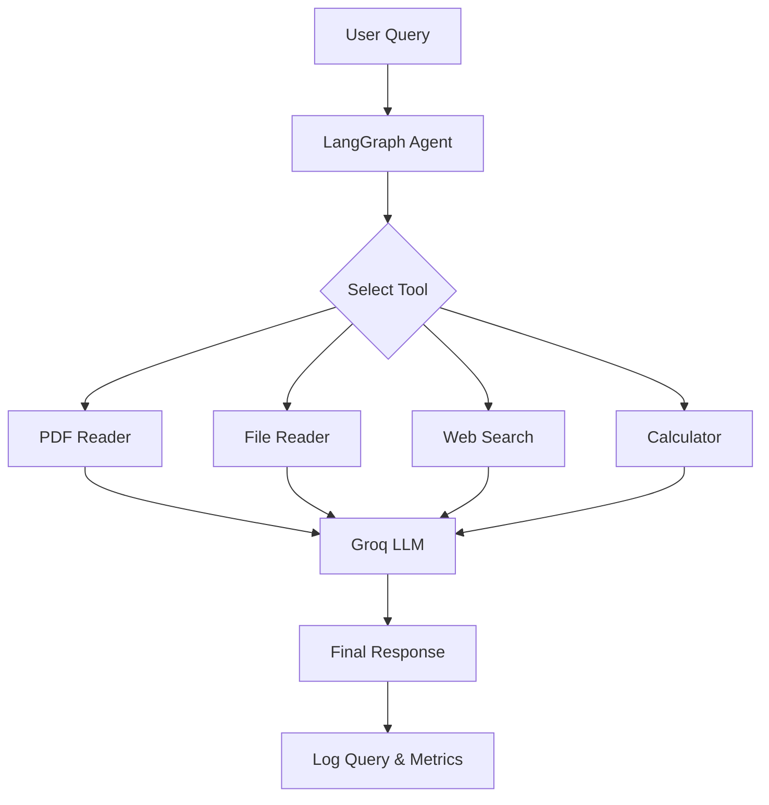

# 🤖 AI Research Assistant

<p align="center">


</p>

An **AI-powered Research Assistant** built using **LangGraph**, **LangChain**, and **Groq LLM** that intelligently routes user queries to the appropriate tool. The assistant can summarize PDFs, read local files, perform web searches, solve mathematical expressions, and monitor usage through a Streamlit analytics dashboard.

---

# ✨ Features

* 🤖 LangGraph Agent Workflow
* 🧠 Intelligent Tool Selection
* 📄 PDF Summarization
* 📁 Local File Reader
* 🌐 Real-time Web Search (DuckDuckGo)
* 🧮 Mathematical Calculator
* 📊 Query Logging
* ⏱️ Latency Tracking
* 📈 Streamlit Analytics Dashboard
* 🔄 Modular & Extensible Architecture

---

# 🏗️ Workflow



---

# ⚙️ Tech Stack

| Category       | Technologies         |
| -------------- | -------------------- |
| Language       | Python               |
| AI Framework   | LangChain, LangGraph |
| LLM            | Groq (Llama 3.x)     |
| Dashboard      | Streamlit            |
| Search         | DuckDuckGo Search    |
| PDF Processing | PyPDF                |
| Data Analysis  | Pandas               |

---

# 📁 Project Structure

```text
AI_Research_Assistant/

├── Agent_chatbot.py        # Main AI Agent
├── dashboard.py            # Streamlit Dashboard
├── logs.json               # Query Logs
├── requirements.txt
├── .env.example
└── README.md
```

---

# 🚀 Installation

### Clone the repository

```bash
git clone https://github.com/JenilMangukiya08/AI_Research_Assistant.git
```

### Navigate to the project

```bash
cd AI_Research_Assistant
```

### Create a virtual environment

```bash
python -m venv venv
```

### Activate the virtual environment

**Windows**

```bash
venv\Scripts\activate
```

**Linux / macOS**

```bash
source venv/bin/activate
```

### Install dependencies

```bash
pip install -r requirements.txt
```

---

# 🔑 Environment Variables

Create a `.env` file in the project root.

```env
GROQ_API_KEY=your_groq_api_key
```

---

# ▶️ Run the AI Assistant

```bash
python Agent_chatbot.py
```

---

# 📊 Run the Dashboard

```bash
streamlit run dashboard.py
```

The dashboard provides:

* Total Queries
* Average Latency
* Query History
* Tool Usage Statistics
* Latency Visualization

---

# 💬 Example Queries

```
Summarize ML.pdf

Read notes.txt

Calculate (45 * 98) + 100

Latest AI news

Who is the CEO of Apple?

USD to INR exchange rate
```

Type `exit` to close the assistant.

---

# 🛠️ Available Tools

| Tool           | Description                        |
| -------------- | ---------------------------------- |
| 📄 PDF Reader  | Reads and summarizes PDF documents |
| 📁 File Reader | Reads local text files             |
| 🌐 Web Search  | Searches the web using DuckDuckGo  |
| 🧮 Calculator  | Solves mathematical expressions    |

---

# 📋 Logging

Every query is automatically recorded with:

* User Query
* Selected Tool
* Response Time
* Timestamp

Logs are stored in:

```text
logs.json
```

---

# 🚀 Future Improvements

* Conversation Memory
* Multi-PDF Support
* Retrieval-Augmented Generation (RAG)
* Voice Assistant
* Database Integration
* Authentication & User Management
* Docker Deployment
* REST API Support

---

# 👨‍💻 Author

**Jenil Mangukiya**

**AI/ML Engineer • Generative AI Developer • Python Developer**

---

## ⭐ Support

If you found this project useful, consider giving it a **⭐ Star** on GitHub.
